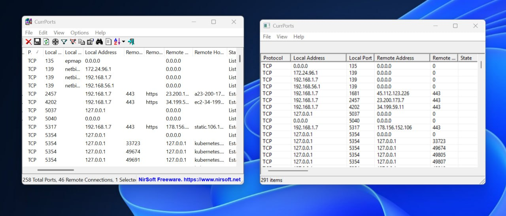

# pire

Reverse-engineering agent. Give it a binary, URL, or directory and it figures out what to do. It can triage, decompile, document, reimplement, or whatever the task calls for.

## Quick start

**Docker (one line, no install needed):**
```bash
docker run -it --rm -v $(pwd):/workspace ghcr.io/evangit2/pire:latest
```

**Linux/macOS/WSL (macOS needs brew):**
```bash
curl -fsSL https://raw.githubusercontent.com/evangit2/pire/main/install.sh | sh
```

**Windows (PowerShell) (IN BETA, recommended to just use WSL instead):**
```powershell
irm https://raw.githubusercontent.com/evangit2/pire/main/install.ps1 | iex
```

The installer detects your platform and asks which components you want (Wine, Ghidra, Frida, JADX, ILSpy, etc.). Use `--all` for everything, `--core` for just the essentials.

**Then run:**
```bash
pire
```

And just tell it what you need:
```
> analyze /bin/ls and write up what it does
> decompile this binary and reimplement it in C
> what does this firmware image contain?
```

## What it does

pire has 30 RE tools available and picks the right ones based on what you ask for. A typical workflow might include some of:

- **Fetch** — download from URL if needed
- **Auto-detect** — identify file type (PE, ELF, Mach-O, APK, .NET, firmware, archive)
- **Triage** — extract strings, map sections, parse imports/exports
- **Disassemble & decompile** — use Radare2, Ghidra, or format-specific tools
- **Document** — write an `analysis.md` describing behavior
- **Reimplement** — write portable C source matching the original's behavior
- **Verify** — compile and run differential tests

But you can also just ask it to extract strings from a file, check entropy, trace a specific function, or anything else the tools support. The workflow adapts to the task.

## Requirements

- **Node.js** 22+
- **Radare2** (always installed)
- An LLM API endpoint (OpenAI-compatible)

Optional (installer prompts for these):
- **Wine** — run Windows PE binaries on Linux/macOS
- **MinGW-w64** — cross-compile Windows binaries
- **Ghidra** — decompiler (large download)
- **Frida** — dynamic instrumentation
- **GDB** — scripted debugging
- **Binwalk** — firmware extraction
- **JADX** — APK/DEX → Java decompiler
- **ILSpy** — .NET → C# decompiler
- **Yara** — pattern matching
- **Volatility** — memory forensics
- **Python RE tools** — capstone, keystone, unicorn, angr, lief

## Install

### Linux / macOS

```bash
# One-liner
curl -fsSL https://raw.githubusercontent.com/evangit2/pire/main/install.sh | sh

# Or clone and run
git clone https://github.com/evangit2/pire.git
cd pire
./install.sh

# Non-interactive options
./install.sh --all     # install everything
./install.sh --core    # core only (node, npm, git, gcc, radare2)
./install.sh --no-wine # skip wine
```

Supports: Ubuntu/Debian, Fedora/RHEL, Arch Linux, openSUSE, Alpine, macOS (Homebrew), WSL, Windows (Git Bash/MSYS2).

### Windows (PowerShell)

```powershell
# One-liner
irm https://raw.githubusercontent.com/evangit2/pire/main/install.ps1 | iex

# Or clone and run
git clone https://github.com/evangit2/pire.git
cd pire
.\install.ps1 -All      # install everything
.\install.ps1 -CoreOnly # core only
```

Uses winget or Chocolatey for package management.

## Configuration

pire reads LLM configuration from one of these methods (in order):

1. `PIRE_CONFIG` environment variable (path to a YAML config file)
2. `OPENAI_API_KEY` + `OPENAI_BASE_URL` + `OPENAI_MODEL` environment variables

Example using environment variables:

```bash
export OPENAI_API_KEY="your-key-here"
export OPENAI_BASE_URL="https://api.openai.com/v1"
export OPENAI_MODEL="GLM-5.2"
```

Alternatively, create `~/.pire/config.yaml`:

```yaml
base_url: https://api.openai.com/v1
api_key: your-key-here
model: GLM-5.2
```

Set `PIRE_MODEL` to override the model at runtime:

```bash
export PIRE_MODEL="your-preferred-model"
```

### Environment variables

| Variable | Description | Default |
|----------|-------------|---------|
| `WINEPREFIX` | Wine prefix directory | `~/.wine` |
| `PIRE_CONFIG` | Path to LLM config file (YAML) | `~/.pire/config.yaml` |
| `PIRE_MODEL` | Override model name | From config |
| `OPENAI_API_KEY` | LLM API key | — |
| `OPENAI_BASE_URL` | LLM API base URL | — |
| `OPENAI_MODEL` | Model name | `GLM-5.2` |

## Usage

### Interactive TUI

```bash
pire
```

Terminal chat interface. Load a binary with `:load <path>` or just mention a path in chat.

### MCP Server

pire includes a JSON-RPC 2.0 MCP server for programmatic control — drive analysis from scripts, other agents, or CI pipelines:

```bash
pire -mcp                    # stdio mode (for MCP clients)
pire -mcp --port 4242        # HTTP mode on a port
pire -mcp --stdio            # explicit stdio mode
```

The MCP server exposes all 30 tools plus session management:

| Method | Description |
|--------|-------------|
| `initialize` | Handshake + server info |
| `tools/list` | List all available tools with schemas |
| `session.create` | Create an analysis session for a target binary |
| `session.list` | List active sessions |
| `tool.execute` | Run a tool with parameters (optional `sessionId` to record in history) |

Example session:

```bash
# Create a session
echo '{"jsonrpc":"2.0","id":1,"method":"initialize"}
{"jsonrpc":"2.0","id":2,"method":"session.create","params":{"target":"/bin/ls"}}' | pire -mcp --stdio

# List functions, decompile entry point
echo '{"jsonrpc":"2.0","id":3,"method":"tool.execute","params":{"name":"r2","arguments":{"path":"/bin/ls","command":"afl"}}}
{"jsonrpc":"2.0","id":4,"method":"tool.execute","params":{"name":"decompile","arguments":{"path":"/bin/ls","address":"entry0"}}}' | pire -mcp --stdio
```

The `decompile` tool accepts hex addresses (`0x1140`) or symbol names (`main`, `entry0`), supports `format: "pdc"` (pseudo-C, default) or `format: "pdf"` (annotated disassembly), and auto-falls back from `pdc` to `pdf` when output is empty.

### Autonomous Reimplementation

```bash
pire-reimpl <binary.exe>
pire-reimpl <binary.exe> --task "extract all strings and find C2 URLs"
```

Output files go in the binary's directory (`analysis.md`, `reimpl.c`).

## Tools

30 RE tools:

| Tool | Description |
|------|-------------|
| `fetch` | Download files from URLs |
| `extract` | Extract archives (zip, tar, 7z, rar) |
| `filetype` | Identify file type, arch, format |
| `strings` | Extract ASCII/UTF-16 strings |
| `objdump` | Disassemble sections |
| `decompile` | Decompile functions via Radare2 (pseudo-C or annotated disassembly) |
| `disasm_func` | Disassemble a single function (handles stripped + PE + ELF) |
| `readelf` | ELF header analysis |
| `hexdump` | Hex dump at an address |
| `nm` | Symbol table listing |
| `size` | Section sizes |
| `search` | Pattern search (text or hex) |
| `patch` | Patch bytes at offset (with backup) |
| `hash` | MD5, SHA1, SHA256 |
| `entropy` | Shannon entropy (detect packing/encryption) |
| `diff` | Compare two files |
| `r2` | Run Radare2 commands (persistent session, auto-caches analysis) |
| `ghidra_*` | Ghidra decompilation, functions, xrefs, strings |
| `capstone` | Multi-arch disassembly |
| `keystone` | Multi-arch assembly |
| `unicorn` | CPU emulation |
| `angr` | Symbolic execution |
| `lief` | Parse ELF/PE/Mach-O |
| `binwalk` | Firmware extraction |
| `yara` | Pattern matching |
| `frida` | Dynamic instrumentation |
| `gdb` | Scripted debugging |
| `jadx` | APK/DEX/JAR → Java decompiler |
| `ilspy` | .NET → C# decompiler |
| `volatility` | Memory forensics |
| `shell` | Run shell commands (sandboxed) |

## Case Study: Reimplementing CurrPorts

Ran pire against **CurrPorts v2.80** by NirSoft — a Windows network port monitoring utility. Closed-source binary with no public source code.

### The target

- **Binary**: `cports.exe` — 283KB PE32+ executable, ~250 functions
- **Functionality**: Enumerates active TCP/UDP ports, maps them to processes, exports to TXT/HTML/XML/CSV
- **Challenge**: No source code available — full black-box decompilation and reimplementation

### How pire was invoked

```
pire
```

Then in the chat:
> download https://files.catbox.moe/wx601y.zip, extract it and analyze the files. Completely decompile the exe into source code, then compile a version from source. Use wine to test the original and your version.

### What the agent did

**Triage** — Identified the PE32+ binary via `filetype`, parsed PE structure with `lief` (imports, sections, exports), read the readme file. Identified it as CurrPorts v2.80 by NirSoft.

**Decompilation** — Launched Ghidra headless analysis, enumerated ~250 functions via `ghidra_functions`. Systematically decompiled key functions using `ghidra_decompile` with the `path` parameter for auto-loading:
- WinMain and window class registration
- Port enumeration via IP Helper API (`GetTcpTable2`, `GetExtendedTcpTable`, `GetExtendedUdpTable`)
- ListView population and window procedure
- Export routines (TXT, HTML, XML, CSV)
- Process info retrieval (`OpenProcess`, `GetModuleFileNameEx`, `QueryFullProcessImageName`)

Each decompiled function was appended to `/tmp/decompiled.c` using `append_file` to preserve context across the long session.

**Reimplementation** — Wrote a clean C reimplementation (`cports.c`, 41KB) capturing the core functionality: port enumeration, process mapping, GUI with ListView, and all four export formats. Created a resource file (`cports.rc`) for the Windows icon and menu.

**Compilation** — Cross-compiled with MinGW:
```
x86_64-w64-mingw32-gcc -mwindows -O2 -o cports.exe cports.c cports_res.o -lcomctl32 -liphlpapi -lws2_32
```

**Differential testing under Wine** — Ran both the original and recompiled binaries side-by-side:
- `/stext` — text export: both enumerated the same active ports
- `/shtml` — HTML export: both produced valid HTML tables
- `/sxml` — XML export: both produced valid XML
- `/scomma` — CSV export: both produced valid CSV

After finding a command-line parsing bug (loop starting at `i=1` instead of `i=0`), the agent used `patch_file` to fix it surgically and recompiled.

### Results

| Metric | Value |
|--------|-------|
| Binary size (original) | 283 KB |
| Binary size (reimpl) | 283 KB |
| Functions decompiled | ~250 |
| Reimpl source | 41 KB C + 1 KB RC |
| Export formats tested | 4 / 4 working |
| Compilation | MinGW cross-compile |



*Left: CurrPorts v2.80 original (NirSoft) · Right: pire's reimplementation from decompiled source*

https://github.com/user-attachments/assets/5e5ececb-9cbc-4dc6-9b17-2e36a0420d0c

Files in `targets/cports/`:

| File | Description |
|------|-------------|
| `cports_original.exe` | Original binary (NirSoft CurrPorts v2.80, 216KB) |
| `cports.exe` | pire's reimplementation (cross-compiled with MinGW, 283KB) |
| `cports.c` | Reconstructed C source (41KB) |
| `cports.rc` | Windows resource file |
| `cports.chm` | Original help file |
| `readme.txt` | Original readme |
| `comparison.png` | Side-by-side screenshot (original vs reimpl) |

## Testing

```bash
node packages/re-agent/test/test-suite.cjs    # 394 tests
node packages/re-agent/test/test-mcp.cjs       # 72 MCP E2E tests
```

Covers tool registration, lazy loading, system prompt structure, agent loop mechanics, deadline enforcement, decompile integration, MCP server protocol, R2 analysis caching, SIMD/SSE guidance, CRLF/exit code matching.

## Architecture

```
pire/
├── packages/
│   ├── re-agent/          # Core RE agent
│   │   ├── src/
│   │   │   ├── index.ts       # Tool registry (30 tools)
│   │   │   ├── mcp-server.ts  # MCP JSON-RPC server
│   │   │   ├── pire-reimpl.ts # Autonomous RE pipeline
│   │   │   ├── cli.ts         # CLI entry point
│   │   │   ├── tui.ts         # Interactive TUI
│   │   │   └── pire-pi-tui.ts # Pi TUI variant
│   │   └── test/
│   │       ├── test-suite.cjs # CI test suite (394 tests)
│   │       └── test-mcp.cjs   # MCP E2E tests (72 tests)
│   ├── coding-agent/      # General-purpose coding agent
│   ├── ai/                # LLM abstraction layer
│   ├── client/            # API client
│   ├── server/            # Local server
│   └── ghidra-mcp/        # Ghidra MCP integration
├── targets/               # Test binaries
│   ├── cports/            # CurrPorts v2.80 (NirSoft) — full decompile + reimpl
│   └── xxd/               # ckormanyos/xxd v1.2 — hex dump utility
├── install.sh             # Cross-platform installer (Linux/macOS/WSL)
├── install.ps1            # Windows installer (PowerShell)
└── .github/workflows/     # CI + release pipelines
```

## Token efficiency

~4,000 tokens initial input per chat session:

| Component | Tokens |
|----------|--------|
| System prompt | ~250 |
| Tool schemas (30 tools) | ~3,800 |
| **Total initial input** | **~4,000** |
| Output cap (`max_tokens`) | 8,192 |

## License

MIT
